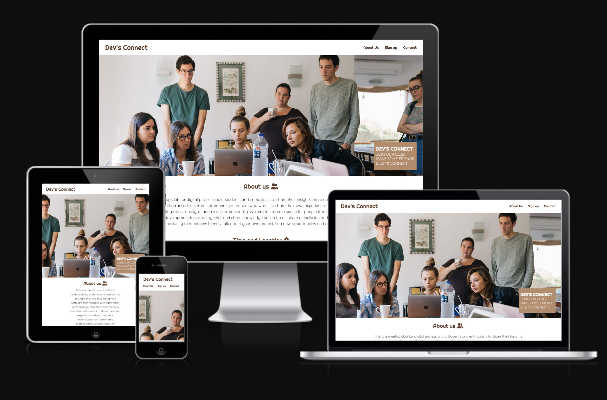
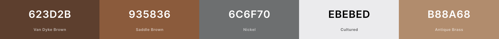
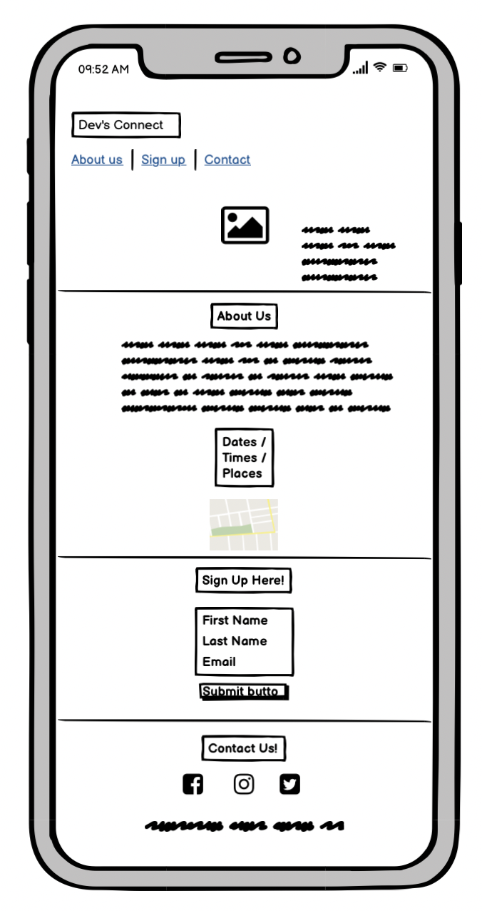
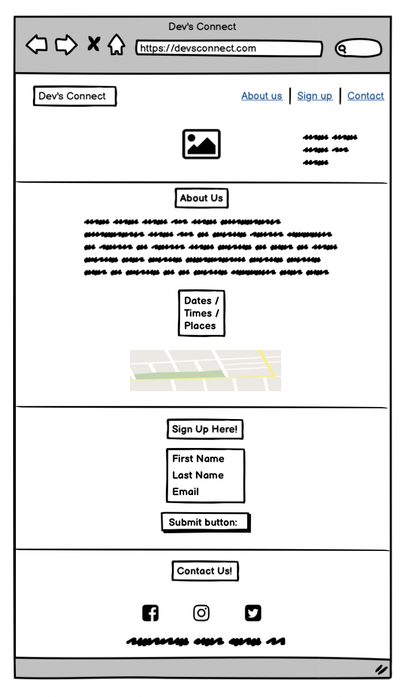
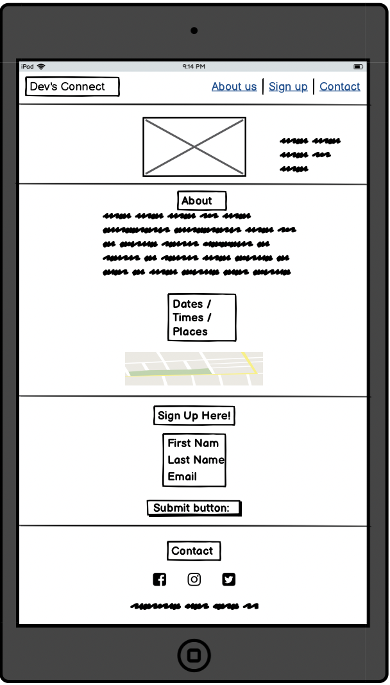
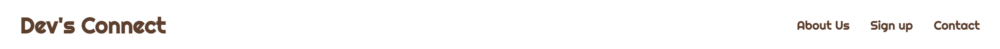
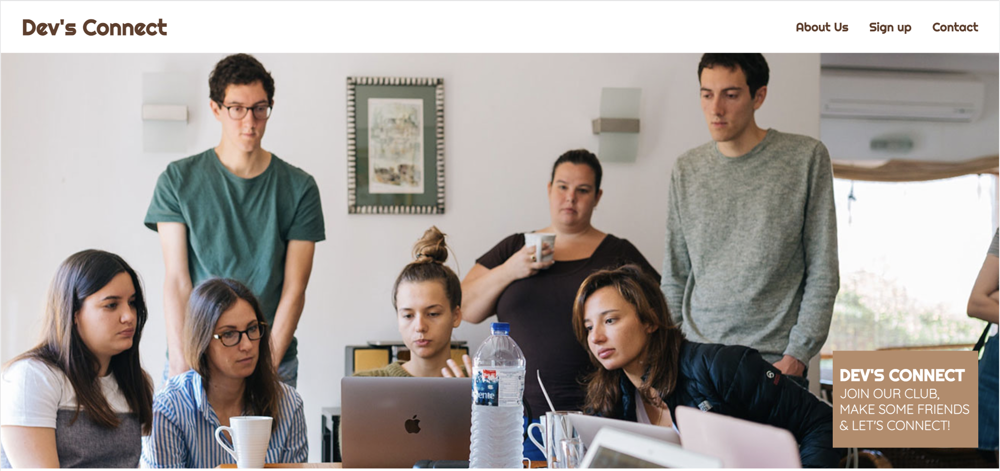
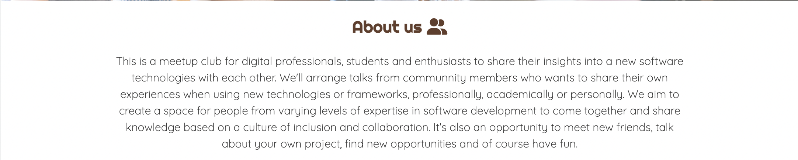
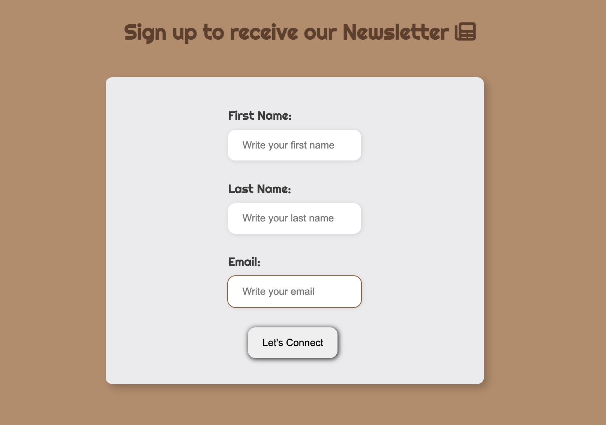
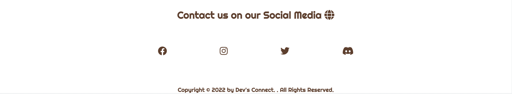

# **Dev's Connect**

Dev's Connect is a meetup club for digital professionals, students and enthusiasts to share their insights into a new software technologies with each other. The site will be targeted toward the techonogy people in general who are looking for a way to socialise and It's also an opportunity to meet new friends, talk about your own project, find new opportunities and of course have fun.

## Live Site 
[Dev's-Connect](https://giov3ss.github.io/Devs-Connect/)

## Repository
[https://github.com/Giov3ss/Devs-Connect](https://github.com/Giov3ss/Devs-Connect)

- - -

## **Table of Contents**

1. [UX Development](#ux-development)
    * [Project Goal](#project-goal)

    * [User Stories](#user-stories)
        * [New User](#new-user)
        * [Admin User](#admin-user)
        * [Target Audience](#target-audience)

    * [Design](#design)
        * [Colour Scheme](#colour-scheme)
        * [Typography](#typography)
        * [Imagery](#imagery)
        * [Site Structure](#site-structure)
        * [Wireframes](#wireframes)
      
2. [Features](#features)  
    * [Existing Features](#existing-features)
        * [Navigation Bar](#navigation-bar)
        * [Header](#header)
        * [About Section](#about-section)
        * [Newsletter Section](#contact-section)
        * [Footer](#footer)
        
3. [Technology Used](#technology-used)  
    * [Language Used](#language-used)
    * [Tools and Libraries](#tools-and-libraries)

4. [Testing](#testing)

5. [Deployment](#deployment)  
  
6. [Credits](#credits)  
    * [Content](#content)
    * [Media](#media)  

- - -

# **Table of Contents**
### Project Goal 
Show my competence building a responsive website using HTML and CSS.

The site should promote and help anyone who wants to start a career in the Technology field, also having a weekly Newletters for who subscribe at the page. 

## User Stories
### New User
* I want to easily navigate to the site and find all the informations that I need.
* I want to know about the project and what is about.
* I want to know the location, time and address.
* I want to subscribe to receive the Newletters and updates.
* I want to interact and be part of the group using social media.

### Admin User 
* Receive the correct information from subscribers.
* Send any updates.
* Send the weekly Newletters.

### Target Audience 
* General Technology Consumers.

## Design
### Colour Scheme 

The colours scheme was inspired by the Hero Image, with different shades of Dyke Brown and Saddle Brown.

The colour was design by [Coolors] (https://coolors.co/623d2b-935836-6c6f70-ebebed-b88a68) to generate some color code as inspiration for the website.

### Typography

Google fonts was used:

Righteous: Was used for the headings of the site
Quicksand: Was used for the content of the site.

### Imagery
The photos were obtained from the free provider: [Pexels] (https://www.pexels.com/photo/group-of-people-watching-on-laptop-1595385/).

### Site Structure

Dev's Connect is a 4-section, 2-page website. The home page is the default loading page and the other sections are accessible from the navigation menu on the right side of the page.

### Wireframes 

The wireframes were produced using: [Balsamiq](https://balsamiq.com/).

#### Phone 

#### Desktop

#### Tablet

## Features 

### Navigation Bar

- The navigation bar is responsive and fixed at the top of the page where it shows the name of the site and navigation bar on the right side. 
- The links in the navigation bar on the right take the user to the right section of the site on the same page.

### Header
- The header contain the hero-image of the site and a small box on the right inviting the user to join this club.

### About Section 
- The about section explain to the user more about this meetup club, for what purpose was created and show the main goal with users.

### Sign Up Newsletter Section
- The newsletter section has a form to collect data for the user who wants to be part of the club and receive news updates and weekly newsletter about the world of technology by email.

### Footer Section
- The footer has our contact on social networks, in case the user wants to contact us or just follow us to see our posts from our meetings.

### Languages Used 

- HTML and CSS were used to create this website.

### Frameworks, Libraries & Programs Used
- [Balsamiq](https://balsamiq.com/) - For Wireframes.
- [Adobe Photoshop](https://www.adobe.com/) -  For manipulating images.
- [coolors.co](https://coolors.co/623d2b-935836-6c6f70-ebebed-b88a68) - The color scheme that was used on the site.
- [Font Awesome](https://fontawesome.com/) - Various icons used throughout the site, using version 5.
- [Google Fonts](https://fonts.google.com/) - Both fonts were used by Google Fonts.
- [Chrome Devtools](https://developer.chrome.com/docs/devtools/) - Used extensively to experiment with grid, flexbox and general responsiveness. 
- [Gitpod](https://www.gitpod.io/) - Used to create and host the website.
- [Github](https://github.com/) - Used to deploy the website.
- [Am I Responsive](https://ui.dev/amiresponsive) - Used to creat an image displaying the homepage on multiple devices.

### Deployment 

The site was deployed to Github pages.

### Deploy to GitHub Pages

1. Navigate to the settings tab in the GitHub repository
2. Once in settings, navigate to the pages tab on the left of the page 
3. Under source, select branch ‘master’ and then click ‘save’
4. page will no automatically refresh and show a detailed ribbon display to indicate deployment

### To Fork the Repository 

To make a copy or ‘fork’ the repository - 

1. Log into GitHub and locate repository
2. On the right hand side of the page select the ‘fork’ option to create and copy of the original

### To create a Local Clone 

1. under the repository name, click on the ‘code’ tab
2. in the clone box, HTTPS tab, click on the clipboard icon 
3. in your IED open GitBash
4. Changed the current working directory to the location you want the cloned directory to be made
5. Type ‘git clone’ and then paste the URL copied from GitHub
6. press enter and the local clone will be created 

### Testing

[Testing.md](TESTING.md) 

### Credits
I would like to thank my mentor Malia for her help and advise all the time. 

### Media 
The Hero-Image are from the free website: [Pexels](https://www.pexels.com/).
