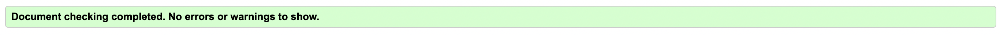
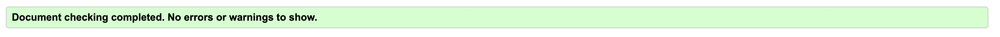
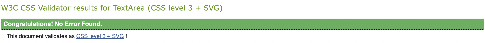
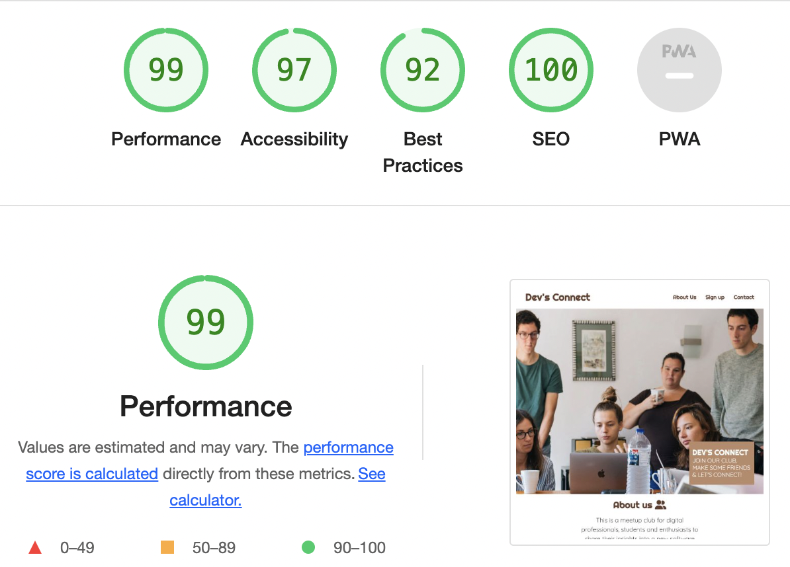

# Testing 

The Dev's Connect site has been tested in the following ways -

- [Code Validation](#code-validation)
    - [W3C HTML Validator](#w3c-html-validator) 
    - [W3C CSS Validator](#w3c-css-validator)
- [Lighthouse](#lighthouse)
- [Browser Compatibility](#browser-compatibility)
- [Bugs](#bugs)

## Code Validation 

### W3C HTML Validator

Index Page:

Thanks Page:

### W3C CSS Validator 

All pages passed the CSS validator without error. 

## Lighthouse 

I used Lighthouse in Chrome Developer Tools to test each of the pages for:

- Performance - How the page performs whilst loading.
- Accessibility - How accessible is the site for all users and how can it be improved.
- Best Practices - How does the site conform to industry best practices.
- SEO - Search engine optimisation. Is the site optimised for search engine result rankings.

## Browser Compatibility

The site was tested on Google Chrome, Microsoft Edge, Safari and Mozilla Firefox, with no visible issues for the user. Appearance, functionality and responsiveness were consistent throughout for a range of device sizes and browsers.

## Bugs

There are no bugs on the website.